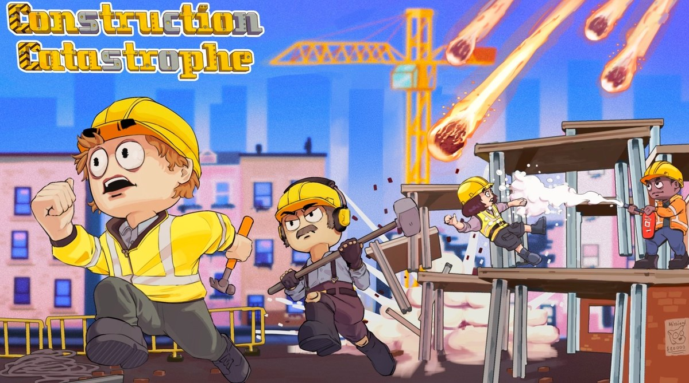
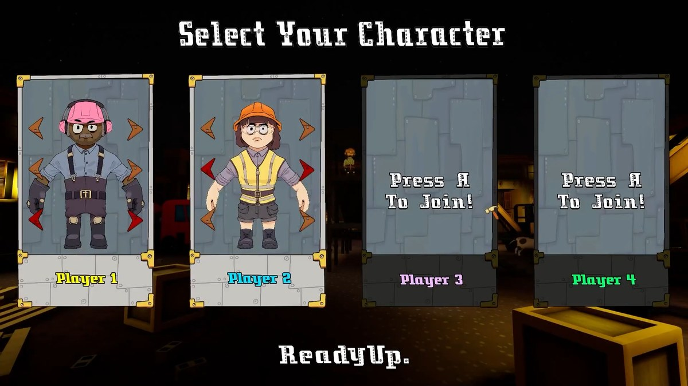

# Construction Catastrophe

**Repository for my university team project Construction Catastrophe**

---

## Overview

Construction Catastrophe is a four-player local co-op party game built in Unreal Engine 5. Teams race to build their
construction site across three locations while earthquakes, hurricanes, meteor showers and tsunamis try to bring it
back down, before turning on each other in a physics-based scramble to finish on top.

The project was built over six weeks in early 2023 by a team of fifteen across tech, design and art as part of the
Computer Games Design course at Staffordshire University, and was shown at CGD'23 Play Test Week.

---



---

## Features

- **Four-Player Local Co-op**: Up to four players on one machine, each joining on their own controller from the character select screen.
- **Build and Action Phases**: A timed build phase on a placement grid, followed by an action phase where the site has to survive.
- **Four Disasters**: Earthquake, Hurricane, Meteor Shower and Tsunami, each with their own destruction behaviour.
- **Three Locations**: Hawaii, Italy and Japan, each changing the layout and hazards of the site.
- **Character Customisation**: Male and female characters with customisable options, chosen before the round starts.
- **Destructible Geometry**: Structures deform and collapse under disaster damage rather than simply despawning.



---

## My Role

I joined as **Tech Lead** and took on **Producer** and **Design Lead** as well when the team ran into difficulty part
way through. I ended up the repository's largest contributor, with 152 of its 602 commits.

- **Game logic**: built `GM_ConCat`, the game mode driving the build phase, the action phase and the menus between them.
- **Local multiplayer**: set up four-player gamepad support, including binding players to their own controller ID on join.
- **Character select and customisation**: the selection screen, player tiles, and the male and female customisation options.
- **Grid building system**: worked on the block placement grid the build phase runs on.
- **Mentoring and process**: mentored two junior programmers and the design team, ran the schedule, and kept
  communication moving between the tech, design and art teams.

---

## Controls

Designed for gamepads. Each player joins by pressing **A** on their own controller at the character select screen,
then readies up to start the round.

---

## Getting Started

***Option 1: Play the build***
1. **Download from itch.io**:
   ```bash
   Go to - https://mreaston.itch.io/constructioncatastrophe
   Select 'Download Now'
2. **Extract the downloaded zip file**:
   ```bash
   Open the unzipped file
   Double-click the .exe file

***Option 2: Open the project***

Note the repository is roughly 2.4 GB, as Unreal stores its assets as binary files.

1. **Clone the repository**:
   ```bash
   git clone https://github.com/Jake2508/Game-3D-Construction-Catastrophe.git
   cd Game-3D-Construction-Catastrophe
2. **Open Unreal Engine 5.0**:
   ```bash
   Open ConCat.uproject
3. **Select Play**:

---

## Built With
Unreal Engine 5 - Game Engine

Blueprint - Gameplay Scripting

---

## Team

**Technical** - Jake Rose (Producer, Lead Technical Designer, UI), Kushagra Bansal, Thomas Stevens, Charlie Flockhart

**Design** - Lincoln Snow (Lead), Matt Kieran, Henry-George Davenport, Jude Kelly-Whitfield, Ryan Banks, Aaron Williams

**Art** - Daniel Chilton (Lead), Amy Wozny, Tyler Heath, Charlie Surrey, Cory Harris
